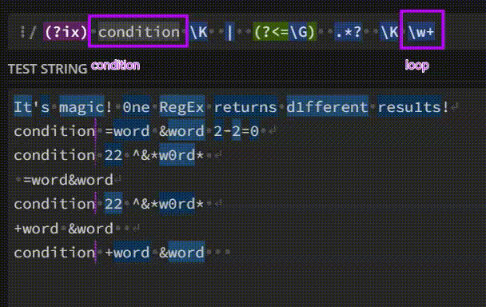

### Regex Invention
I want to share my invention, which allows you to use only one RegEx, which will search for substrings in a string with a certain condition. If you want, call it a RegEx loop that didn't exist before!


I will share with you not only options for implementing loops in RegEx, but also show various examples from simple to complex.

Please note that the RegEx uses *spaces* to improve *readability*. RegEx usually treats spaces as characters, so for these patterns to work, a [flag](https://riptutorial.com/regex/topic/5138/regex-modifiers--flags-) `(?ix)` is required.

In the examples, the RegEx parts are *split into lines*, which is necessary to improve perception but this feature is not supported by RegEx. The examples use[Perl syntax](https://www.boost.org/doc/libs/1_85_0/libs/regex/doc/html/boost_regex/syntax/perl_syntax.html).

#### Explanation

Let's start with a simple task. Find a string that starts with the letter `c` and find all the words and numbers in it:

```css
c word = word + key
c 12 = word + word
word & word = word + word
12 = word + word
```

We expect to highlight only the [words](https://en.wikipedia.org/wiki/Regular_expression#Character_classes) `word` and the [number](https://en.wikipedia.org/wiki/Regular_expression#Character_classes) `12` only in the first two lines since by the `condition` of the task, the line must begin with the letter `c`. However, we must also take into account that there are `separators` between words: different characters like ` = + &`

The template for a similar task looks like this:

```python
# Condition under which the second part will be triggered
condition \K  # Match the condition and reset the match start

|  			  # Beginning of the loop

(?<=\G)  		# Ensures that the condition is found; the loop starts from the position of the condition/previous iteration
separator*?  	# Non-greedy: zero and more separators before expresseion: space, char, ...
\K  			# Reset the match start again
expression  	# Match the expression: \w+ or .+ ...
```

**The idea**: after encountering `condition`, the RegEx skips its `\K` and continues searching from its position `(?<=\G)` . He passes by [non-greedy](https://riptutorial.com/regex/topic/429/greedy-and-lazy-quantifiers) word `separator` , skips it `\K` and finally captures the `expression`. 

After reaching the end, everything repeats again from the position of the last found word `(?<=\G)`.  However, after the entire RegEx is completed, the loop will start from the beginning. But in order for the loop to go the right way and continue to walk along the line, you need to add the [character](https://en.wikipedia.org/wiki/Vertical_bar) *or*  `|` before `(?<=\G)`. 

Pay attention to the [symbol](https://dev.to/marounmaroun/what-does-k-mean-in-regex-4l6n) `\K`: *forget everything before and start highlight from this position*. Slide the carriage/cursor. Allows you to find a `condition`, **cut it off** from the result, and return just `expression`. The main thing to remember is that `\K` does not work in the usual exciting groups `( )`, only in [non-capturing](https://riptutorial.com/regex/example/2155/backreferences-and-non-capturing-groups) and [atomic groups](https://riptutorial.com/regex/topic/8770/atomic-grouping) : `(?:) and (?>)`. 

[The character](https://dev.to/marounmaroun/what-does-k-mean-in-regex-4l6n) `\K` stands after the condition and the separator. I repeat once again: after finding the `condition`, we skip the *condition-template* for the first time, and after going through the `separator` between the words, we will skip the *separator-template* with each iteration. We don't need them, we need **words** and **nums**. 

Now we construct the RegEx according to the template ([DEMO](https://regex101.com/r/wXPPD2/2)):

```python
c \K  		# Condition: "c" literal

|  			# Beginning of the loop

(?<=\G)  		# Ensures that the condition is found; the loop starts from the position of the condition/previous iteration
.*?  			# Non-greedy separator: zero and more chars/spaces
\K  			# Reset the match start again
\w+  			# Greedy: matches any words/numbers (equivalent to [a-zA-Z0-9_])
```

**How we constructed the template:** `condition` is the [letter](https://riptutorial.com/regex/topic/1757/character-classes) `c`, then nothing from the template changed, then `separator` is any char `.*`, then the letter search template \w`, which will cycle through the letters **to the end of the entire string**.

However, such a RegEx highlights the words **to the end of the entire line**: it does not have a `stop condition`. 

**Let's complicate the same task:** find a string that starts with quotation marks `" '` and find only words and numbers in it:

```python
c"word & word" = word + word
c"12 = word" + word
c word & word = word + word
c 12 = word + word
```

The final template looks like this: 

```python
condition\K  # Match the condition and reset the match start

|  			# Beginning of the loop

(?<=\G)  		# Ensures that the condition is found
stop*?  		# The character at which the entire regex stops: [^exclude]
\K  			# Reset the match start again
expression  	# Match the expression: \w+ or .+ ...
```

Now we construct the RegEx according to the template. The template is similar to the previous one, but [quotes](https://riptutorial.com/regex/example/9991/character-class-and-common-problems-faced-by-beginner) `[" ']`  are added to the condition: `c ["']` 

The RegEx `stop condition` appears: `[^"']`*([char](https://riptutorial.com/regex/topic/1757/character-classes#undefined) `^` means everything except the quotes)*. After it, the highlighting of further characters is completed. Now we construct the RegEx according to the template ([DEMO](https://regex101.com/r/FUH7Xx/4)):

```python
c ["'] \K  		# Condition: c" or c'

|  			    # Beginning of the loop

(?<=\G)  		# Ensures that the condition is found
[^"']*?  		# Quotes after which the entire regex stops
\K  			# Reset the match start again
\w+  			# Greedy: matches any words/numbers 
```

Try to solve these problems without using these templates. I will be very glad if you find the optimal solution!

#### Final template

Find a string that starts and ends with the character  `   and find any characters outside the brackets   {  }  in it :

```css
`{string} with {exluded} words 12 nums`
`string {with} {exluded} words 12 nums`
"quoted {string} with {exluded} words and 12 nums"
"quoted string {with} exluded {words} and {12} nums"
```

Simply put, we have to walk along the line, bypassing everything that is enclosed in `{ }` . In this case, there should be two different conditions for stopping: the condition for `stopping and repeating` the cycle if parentheses are found `{ }`; the `condition for stopping RegEx` if   `  found :

```python
# Condition under which the second part will be triggered
^condition  # Char ^ means start of the string

|  		  	# Beginning of the loop

(?<=\G)  	# Ensures that the condition is found; the loop starts from the position of the condition/previous iteration

(?>      	# Start of the atomic group
    skip 		# content to skip: {.*}
 	|  			# OR
    stop    	# The character at which the entire regex stops: [^exclude]
) \K      	# Resets the match, so it is not included in the output

expression  # Match the expression: \w+ or .+ ...
```

**The idea:** after encountering a `condition`, the RegEx starts from its position `(?<=\G)` goes on, stops if a quotation mark is detected, bypasses `skip` group, resets the current position `\K` and finally captures the desired `expression`. 

Having reached the end, all the RegEx is repeated again from the position of the last found word `(?<=\G)`. And so on until the `stop condition` is met.

The atomic group `(?>...)` is used to group sub-patterns that should not be subject to backtracking. This means that once the group finds a match, it is fixed, and the regex engine will not attempt to change this match, even if subsequent parts of the pattern do not match. In this context, the atomic group allows for efficient handling of nested structures, such as curly braces, and ensures that if a match is found within the curly braces, it will not be reconsidered.

The final version ([DEMO](https://regex101.com/r/vZugRo/2)):

```py
^[`]\K # Matches a ` and discards it from the output

|  		# Beginning of the loop

(?>      	# Start of the atomic group
    {.*?}   	# Skips the content within curly braces { }
 	|			# OR
    [^`]    	# Stops RegEx if ` are found
) \K      	# Resets the match, so it is not included in the output

[^{}`]+  	# Matches one or more characters that are not { } `
```

#### Limitations

I will be very glad if you find another optimal solution! Please help me improve these templates. They have significant optimization problems: if `condition` is not found, `alternation (?<=\G) is checked for each character`; there is no skipping of unsuitable lines; flags do not work `(*SKIP)(*F)`. Despite the fast speed of work, the number of steps tends to 100,000.

I will wait for the plugin to improve so that I don't have to solve such problems.…
